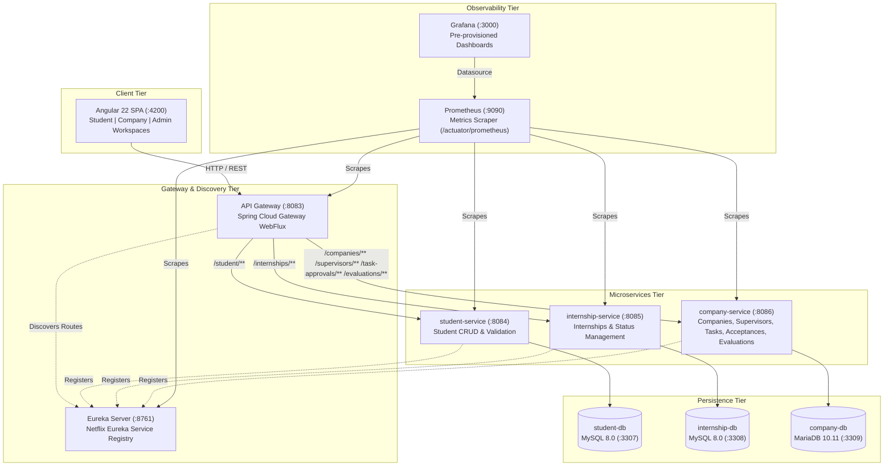

# Internship Management Platform (Subject 5)

An academic and enterprise internship lifecycle management platform built with **Spring Boot & Spring Cloud microservices**, an **Angular 22 standalone frontend**, **Docker Compose & Kubernetes orchestration**, **Prometheus & Grafana observability**, and automated **Jenkins CI/CD**.

---

## 1. System Architecture



---

## 2. Technology Stack & Port Allocations

| Component | Port | Technology | Database / Backend |
|---|---|---|---|
| **Eureka Server** | `8761` | Spring Boot 4.1.1, Spring Cloud 2025.1.3 | In-Memory Registry |
| **API Gateway** | `8083` | Spring Cloud Gateway WebFlux | Reactive Proxy & Load Balancer |
| **Student Service** | `8084` | Spring Boot 4.1.1, Spring Data JPA | MySQL 8.0 (`student_db` on `3307:3306`) |
| **Internship Service** | `8085` | Spring Boot 3.5.5, Spring Data JPA | MySQL 8.0 (`internship_db` on `3308:3306`) |
| **Company Service** | `8086` | Spring Boot 4.1.1, Spring Data JPA | MariaDB 10.11 (`company_db` on `3309:3306`) |
| **Angular Frontend** | `4200` | Angular 22, TypeScript 5.9, SCSS | Communicates via API Gateway (:8083) |
| **Prometheus** | `9090` | Prometheus v3 | Scrapes Actuator metrics |
| **Grafana** | `3000` | Grafana OSS | Default login: `admin` / `admin` |

---

## 3. Local Development

### Prerequisites
- **Java**: OpenJDK 21 or 24
- **Maven**: 3.9+
- **Node.js**: v20+ or v22+
- **Docker & Docker Compose**: v2.20+

### Option A: Local Databases (XAMPP / Standalone MySQL & MariaDB)
If using XAMPP or local database instances:
1. Ensure MySQL is running on port 3306 and create the databases:
   ```sql
   CREATE DATABASE student_db;
   CREATE DATABASE internship_db;
   CREATE DATABASE company_db;
   ```
2. Start services in order:
   - `eureka-server` (`mvn spring-boot:run`)
   - `student-service` (`mvn spring-boot:run`)
   - `internship-service` (`mvn spring-boot:run`)
   - `company-service` (`mvn spring-boot:run`)
   - `api-gateway` (`mvn spring-boot:run`)
3. Run frontend:
   ```bash
   cd frontend
   npm ci
   npm start
   ```
   Open `http://localhost:4200` in your browser.

---

## 4. Building and Testing

### 4.1. Maven Build and Unit/Integration Tests
Build and test every Spring Boot service without skipping tests:
```bash
# Eureka Server
cd eureka-server && mvn clean test package && cd ..

# API Gateway
cd api-gateway && mvn clean test package && cd ..

# Student Service (14 tests)
cd student-service && mvn clean test package && cd ..

# Internship Service (22 tests)
cd internship-service && mvn clean test package && cd ..

# Company Service (28 tests)
cd company-service && mvn clean test package && cd ..
```
Or execute the automated build script:
```bash
# Linux / macOS
chmod +x scripts/build-all.sh && ./scripts/build-all.sh

# Windows PowerShell
./scripts/build-all.sh # or run services individually with mvn
```

### 4.2. Angular Frontend Build and Test
```bash
cd frontend
npm ci
npm test
npm run build
```

---

## 5. Docker Compose Deployment

### 5.1. Database Startup Race Condition Fix
Previously, services crashed on startup with `Connection refused` and `Unable to determine Dialect without JDBC metadata`.
This was solved using:
1. **Docker Healthchecks**: `student-db` and `internship-db` check with `mysqladmin ping`. `company-db` checks with MariaDB healthcheck.
2. **Depends-On Synchronization**: Dependent microservices wait for database containers using `condition: service_healthy`.
3. **Application Resilience**: HikariCP configured with `spring.datasource.hikari.initialization-fail-timeout=0` and 30s connection timeout.

### 5.2. Running with Docker Compose
```bash
# Build JARs first (Jenkins / Local workflow)
mvn -B clean package (across all 5 services)

# Start all containers in background
docker compose down
docker compose up -d

# Verify container statuses and health
docker compose ps
```

### 5.3. Stopping Docker Compose
> [!IMPORTANT]
> Never use `docker compose down -v` unless you intend to wipe all database volumes. Use:
```bash
docker compose down
```

---

## 6. Health Checks & Verification

Run the verification script to validate that all services and gateway routes are operational:
```bash
# Linux / Bash
chmod +x scripts/verify.sh && ./scripts/verify.sh

# Windows PowerShell
powershell -ExecutionPolicy Bypass -File scripts/verify.ps1
```

Verification verifies:
- `http://localhost:8761/actuator/health` (Eureka Discovery)
- `http://localhost:8083/actuator/health` (API Gateway)
- `http://localhost:8083/student` (Gateway $\rightarrow$ Student Service)
- `http://localhost:8083/internships` (Gateway $\rightarrow$ Internship Service)
- `http://localhost:8083/companies` (Gateway $\rightarrow$ Company Service)

---

## 7. Jenkins CI/CD Pipeline

The repository contains a declarative [`Jenkinsfile`](file:///C:/Users/user/Desktop/subject%205/Jenkinsfile) designed for Linux/VM Jenkins environments.

### Required Jenkins VM Configuration
1. **Tools required on Jenkins agent**:
   - Java 21+ (`java -version`)
   - Maven 3.9+ (`mvn -version`)
   - Docker CLI & Compose plugin (`docker compose version`)
   - Git (`git --version`)
2. **Docker permissions for Jenkins**:
   ```bash
   sudo usermod -aG docker jenkins
   sudo systemctl restart jenkins
   ```
3. **Optional SonarQube credentials**:
   - Set global environment variable `SONAR_HOST_URL` (e.g. `http://sonarqube:9000`).
   - Add Secret Text credential `SONAR_AUTH_TOKEN`.

### Pipeline Execution Flow
1. **Checkout**: Clones branch.
2. **Environment Validation**: Confirms CLI tools.
3. **Build & Test Spring Boot Services**: Compiles and executes unit/integration tests with `mvn clean package`.
4. **Build & Test Angular Frontend**: Runs `npm ci && npm test` inside a Node container.
5. **SonarQube Analysis**: Runs static code inspection when `SONAR_HOST_URL` is present.
6. **Build Docker Images**: Builds lightweight JRE runtime images from pre-built JARs.
7. **Deploy Platform**: Starts stack with Docker Compose.
8. **Verify Deployment**: Executes `./scripts/verify.sh`.
9. **Kubernetes Validation**: Syntax dry-run against `k8s/` manifests.
10. **Monitoring Verification**: Verifies Actuator metrics endpoints.

---

## 8. Kubernetes / Minikube Deployment

The `k8s/` directory contains complete Kubernetes manifests for all microservices, databases, and configuration:

```bash
# Start Minikube (2GB RAM configuration)
minikube start --driver=docker --memory=2048

# Load locally built images into Minikube
minikube image load eureka-server:latest
minikube image load api-gateway:latest
minikube image load student-service:latest
minikube image load internship-service:latest
minikube image load company-service:latest

# Deploy all manifests
kubectl apply -f k8s/01-configmap.yml
kubectl apply -f k8s/02-secrets.yml
kubectl apply -f k8s/03-databases.yml
kubectl apply -f k8s/04-eureka.yml
kubectl apply -f k8s/05-services.yml
kubectl apply -f k8s/06-gateway.yml

# Check pod status and readiness probes
kubectl get pods -w
kubectl get services
```

---

## 9. Observability: Prometheus & Grafana

All 5 Spring Boot services include **Spring Boot Actuator** and **Micrometer Prometheus Registry**.
- Prometheus configuration: [`monitoring/prometheus.yml`](file:///C:/Users/user/Desktop/subject%205/monitoring/prometheus.yml)
- Grafana Datasource: [`monitoring/grafana/provisioning/datasources/datasource.yml`](file:///C:/Users/user/Desktop/subject%205/monitoring/grafana/provisioning/datasources/datasource.yml)
- Grafana Dashboard: [`monitoring/grafana/provisioning/dashboards/platform-overview.json`](file:///C:/Users/user/Desktop/subject%205/monitoring/grafana/provisioning/dashboards/platform-overview.json)

Accessing dashboards:
1. Open `http://localhost:3000` (User: `admin`, Password: `admin`).
2. Navigate to **Dashboards** $\rightarrow$ **Internship Platform** $\rightarrow$ **Internship Platform Overview**.
3. View JVM Heap Memory, HTTP request counters, system CPU usage, and live thread counts in real time.

---

## 10. End-to-End Workflow Demonstration

1. **Student Registration**:
   - `POST /student` creates a student record.
2. **Internship Request Submission**:
   - `POST /internships` creates a pending internship request with date order validation.
3. **Company Acceptance / Refusal**:
   - `POST /acceptances` (or `PUT /internships/{id}` with `status=ACCEPTED`) transitions the internship request.
4. **Task Assignment & Approval**:
   - `POST /task-approvals` records milestones. Company supervisor reviews with `status=APPROVED`.
5. **Supervisor Evaluation**:
   - `POST /evaluations` records quality, punctuality, and communication scores (0-20), automatically computing the overall grade.
